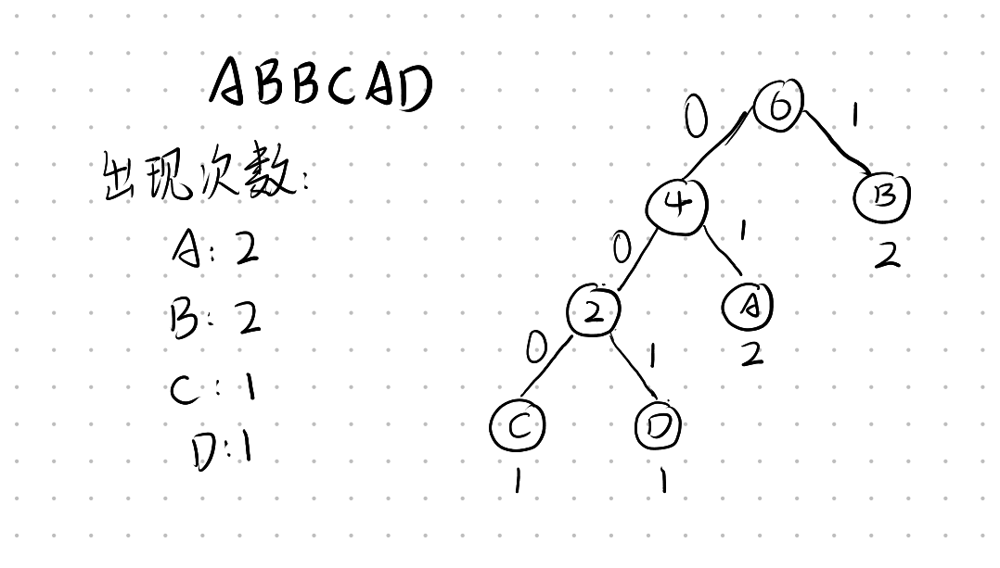

<font face=STKaiti><font size=4px>

# 哈夫曼树和哈夫曼编码

> 最优二叉树，**带权路径长度最短**的二叉树。

---

## 引出问题

对于`ABBCAD`，找到最短且不会引发分歧的二进制代码表示该字符串。

---

## 分析问题

要找到**最短且不会引发分歧的路径**，需要做到两点：
- 得到的二进制代码有且仅有一种解码方式。
- 得到的二进制代码尽可能短。

---

## 解题思路

- 要保证一个字符的二进制表示不能是另一个字符的前缀，例如：`A:1, B:10`就会导致解码过程中对于`10`无法判断是`B`，还是`A`和其他字符的组合。
- 对于出现次数较多的字符，其二进制编码要尽可能短。

因此，我们可以采用二叉树的形式将这些字母表示出来，出现次数越少的字符在树的越底层。



其中向右的分支用`1`表示，向左的分支用`0`表示。则可以表示为`A: 01, B: 1, C: 001, D: 000`，由于每个字符都是叶子节点，因此不可能出现一个字符为另一个字符的前缀，并且实现了出现次数越多的字符二进制编码最短。由此得到的二进制编码`011100101000`是**不会产生分歧的最短二进制编码**，称之为**哈夫曼编码**，而这棵二叉树称之为**哈夫曼树**。
实际应用：

```c++
int main () {
    long long N, result = 0, tmp = 0;
    cin >> N;
    priority_queue<long long, vector<long long>, greater<long long>> q;
    for (int i = 0; i < N; i++) {
        cin >> tmp;
        q.push(tmp);
    }
    while (!q.empty()) {
        tmp = q.top();
        q.pop();
        if (!q.empty()) {
            tmp += q.top();
            q.pop();
            q.push(tmp);
            result += tmp;
        }else {
            break;
        }
    }
    cout << result << endl;
    return 0;
}
```