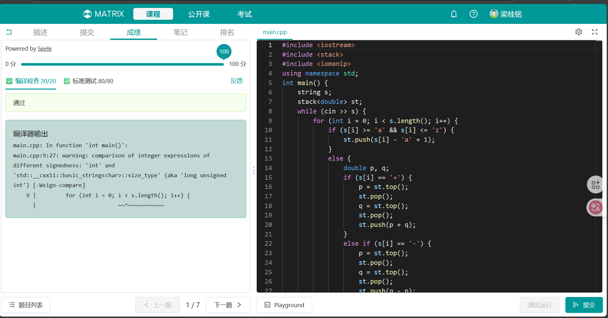
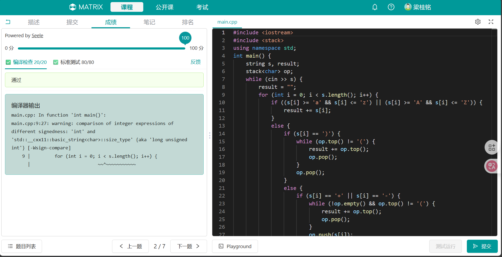
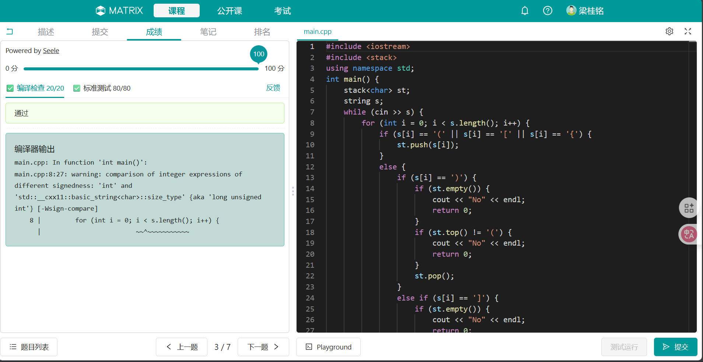

<font face=STKaiti><center>

# 中山大学计算机学院本科生实验报告
### （2025学年第1学期）</center>


课程名称：数据结构与算法实验 &nbsp;&nbsp;&nbsp;&nbsp;&nbsp;&nbsp;&nbsp;&nbsp;任课老师：张子臻
|  |  |  |  |
|:-----:|:-------:|:-------:|:--------:|
| 年级: | 2024级   | 专业(方向):   | 计算机科学与技术(人工智能与大数据)
| 学号: | 24325155 | 姓名: | 梁桂铭
| 电话: | 15817681625 | Email: | lianggm8@mail2.sysu.edu.cn
| 开始日期: | 2025年9月17日 | 完成日期: | 2025年9月18日

## 第一题

### 1.实验题目
#### 题目描述
来自USA的Mr.Allison是某班的英语老师，学期开始之前他要求自己班的同学阅读一本英文小说，并写一份50000字的读书报告。该班的同学很苦恼，并想方设法让Mr.Allison放弃读书笔记这个念头，于是该班的大牛PYY想到一个借口：看那么多份读书笔记会花费很多时间的！把这个理由告诉Mr.Allison之后，Mr.Allison也觉得挺有道理，但一共要阅读多少文字呢？于是PYY就给出一条后缀表达式，并告诉Mr.Allison说，这条表达式的结果就是您要阅读的文字。Mr.Allison的数学不咋地，于是就找你来帮他计算这条后缀表达式的值。

#### 输入描述
一个长度不超过100的字符串，代表一条**后缀表达式**。表达式中只含有`+、-、*、/` 四种运算符和26个小写英文字母，不含其它字符。每一个英文字母代表一个**正整数**：

`a = 1,b = 2,c = 3...y = 25,z = 26`

#### 输出描述
每一个输入样例，单独一行输出结果：后缀表达式的值，一个正实数 S，保留两位小数。

### 2.实验目的

1. 掌握**后缀表达式**（逆波兰表达式）的计算原理。
2. 熟悉利用**栈**（stack）来处理表达式求值的基本算法。
3. 提高对**字符串**与**数据结构**结合使用的理解与编程能力。

### 3.算法设计

要求解这道题，本质上是理解**后缀表达式**的运算原理：实际上是**将操作数放在运算符之前**，用**二叉树**来理解，即将我们所用的运算式通过**二叉树**展开后，写成**左子树**+**右子树**+**根**的形式。

根据**后缀表达式**的原理，我们可以得到一个结论：**后缀表达式**中的每个**运算符**的操作数实际上是该运算符**之前的两个数**。例如，对于`(p + q) * r`，其写成**后缀表达式**即为`pq+r*`，先计算`pq+`得到结果`sum = p + q`，再计算`sum * r`。

根据以上结论，我们可以设计出以下**算法思路**：
1. 创建一个空栈。
2. 从左到右扫描字符：
- 如果是**字母**：转换为**数字**:`value = <char> - 'a' + 1`，压栈。
- 如果是**运算符**：从栈中弹出两个元素（注意顺序，先弹出的是**右操作数**，尤其是在处理`-`和`/`的时候），执行运算，然后将结果压回栈中。
3. 扫描结束后，**栈顶元素**即为表达式的值。
4. 输出结果，保留两位小数(用`double`或`float`来存储数据)。

### 4.程序运行与测试

#### matirx测试结果



#### 测试样例

输入：
```bash
ab+c*
int**py++
```
输出:
```bash
9.00
2561.00
```

#### 复杂度分析

- **时间复杂度**：设字符串长度为n，有m组字符串，每次整个过程遍历一遍字符串，因此复杂度为`O(mn)`。
- **空间复杂度**：需要一个栈存储操作数，最坏的情况是所有字符均为操作数，因此复杂度为`O(n)`。

### 5.实验总结与心得

本实验让我对**后缀表达式**有了更加深刻的理解，同时也加深了我对**栈**的认识和应用，代码的练习也巩固了我的C++语法基础。虽然理清楚了解题思路，但在写代码的过程中我也遇到了许多问题，包括错用`int`类型，忽略了栈弹出的元素是**由右到左**等等，并且在发现错误后修改代码时总是忽略其他部分导致出现更多问题，这些都要在后续练习中不断训练。

## 第二题

### 1.实验题目
#### 题目描述
将**中缀表达式**（infix expression）转换为**后缀表达式**（postfix expression）。假设中缀表达式中的操作数均以单个英文字母表示，且其中只包含左括号`(`，右括号`)`和双目算术操作符`+，-，*， /`。

#### 输入描述
表示中缀表达式的一个字符串（其中只包含操作数和操作符和左右括号，不包含任何其他字符），长度不超过100个字符。

#### 输出描述
对应后缀表达式字符串（其中只包含操作数和操作符，不包含任何其他字符）

### 2.实验目的
1. 理解**中缀表达式**与**后缀表达式**的区别与联系。
2. 掌握运算符**优先级**与**括号**处理的方法。
3. 熟悉**栈**（stack）在表达式转换中的应用。

### 3.算法设计

#### 基本概念
首先我们要明确**中缀表达式**和**后缀表达式**的区别，以下均用**二叉树**描述：

- **中缀表达式**：**左子树**+**根**+**右子树**。
- **后缀表达式**：**左子树**+**右子树**+**根**。

#### 解题思路
根据以上原理，即可设计出将**中缀表达式**转换为**后缀表达式**的算法：
1. 从左到右扫描表达式：
- 遇到**操作数**：直接输出。
- 遇到**左括号**：压入栈。
- 遇到**右括号**：不断弹出**栈顶运算符**并输出，直到遇到**左括号**。将左括号弹出，但**不要输出**，因为**后缀表达式**中不存在括号。
- 遇到**运算符**：当栈顶为运算符，且优先级**大于等于**当前运算符时，弹出栈顶运算符并输出；将当前运算符压栈。
2. 扫描结束后，若**栈不为空**，将栈中剩余运算符依次弹出并输出。

### 4.程序运行与测试
 
#### matrix测试结果



#### 测试样例

输入：
```bash
A+B*C-D-E/F
a+(b-c)*d+e/f
```
输出：
```bash
ABC*+D-EF/-
abc-d*+ef/+
```

#### 复杂度分析
- **时间复杂度**：将每个字符串遍历一遍，复杂度为`O(mn)`.
- **空间复杂度**：栈存储字符，复杂度为`O(n)`.

### 5.实验总结与心得

本实验让我学习到了**中缀表达式转后缀表达式**的算法原理，尤其是处理**符号优先级**和**括号**时，可以用**栈**先进后出的性质巧妙解决。

## 第三题
### 1.实验题目
#### 题目描述
检查输入字符串中的括号是否匹配。括号包括：`{, }, (, ), [,]`.
#### 输入描述
一个长度**不超过100**的字符串。
#### 输出描述
“Yes" or "No"，代表是否匹配。

### 2.实验目的
1. 理解**括号匹配**问题的基本原理。
2. 掌握**栈**（stack）在括号匹配检测中的应用。

### 3.算法设计
要解决本题目，我们首先要理解**括号匹配问题**的原理：
- 保证每种括号的左右括号**数量相等**。
- 不能够出现类似这样的情形：`(])`，即每对括号内部的其他括号一定是**完整的**，不能出现只有一个左括号或右括号。

根据以上原理，我们便可以利用**栈**先进后出的性质设计算法：

从左到右扫描字符串：

1. 当遇到左括号`(, [, {`时，压入栈。
2. 当遇到右括号时，检查栈顶元素是否为对应的左括号，若不是则输出"No"并终止程序；否则弹出该左括号，继续扫描。
3. 当扫描结束后，检查栈是否为空，若为空则输出"Yes"；否则输出"No"。
   
以上为该题目最基本的算法思想。但在具体实现过程中，需要处理许多问题：
- 扫描过程中需要检查**栈**是否为空。
- 每次扫描结束后要检查并弹出栈中剩余的其他元素。

### 4.程序运行和测试

#### matrix测试结果



#### 测试样例

输入
```bash
a
2-[(1+2)*2]
(a+b])
```
输出
```bash
Yes
Yes
No
```

#### 复杂度分析

- **时间复杂度**：将每个字符串遍历一遍，复杂度为`O(mn)`.
- **空间复杂度**：栈存储字符，复杂度为`O(n)`.

### 5.实验总结与心得

本题相对前两道题思路比较简单，但要完全解出也要注意需要处理很多细节，尤其是检查栈是否为空，笔者在写代码过程中因为这一点出现不少错误。通过这三道题，笔者学习并巩固了栈在解决实际问题中发挥的作用，进一步锻炼了笔者的代码能力。

## 附录、提交文件清单

### 第一题
```c++
#include <iostream>
#include <stack>
#include <iomanip>
using namespace std;
int main() {
    string s;
    stack<int> st;
    while (cin >> s) {
    // 处理多组字符串。
        for (int i = 0; i < s.length(); i++) {
            if (s[i] >= 'a' && s[i] <= 'z') {
                st.push(s[i] - 'a' + 1);
            }
            // 将字母转换成数字后压栈。
            else {
                // 处理四个运算符，尤其是-和/要注意运算顺序。
                double p, q;
                if (s[i] == '+') {
                    p = st.top();
                    st.pop();
                    q = st.top();
                    st.pop();
                    st.push(p + q);
                }
                else if (s[i] == '-') {
                    p = st.top();
                    st.pop();
                    q = st.top();
                    st.pop();
                    st.push(q - p); 
                }
                else if (s[i] == '*') {
                    p = st.top();
                    st.pop();
                    q = st.top();
                    st.pop();
                    st.push(p * q); 
                }
                else {
                    p = st.top();
                    st.pop();
                    q = st.top();
                    st.pop();
                    st.push(q / p);
                }
            }
        }
        cout << fixed << setprecision(2) << st.top() << endl;
        // 设置输出精度。
        st.pop();
        // 将结果清空进行下一次循环。
    }
    return 0;
}
```
### 第二题
```c++
#include <iostream>
#include <stack>
using namespace std;
int main() {
    string s, result;
    stack<char> op;
    while (cin >> s) {
        result = "";
        // 每次循环之前都要把上一次的结果清空。
        for (int i = 0; i < s.length(); i++) {
            if ((s[i] >= 'a' && s[i] <= 'z') || (s[i] >= 'A' && s[i] <= 'Z')) {
                result += s[i];
            }
            // 操作数直接压栈。
            else {
                if (s[i] == ')') {
                    while (op.top() != '(') {
                        result += op.top();
                        op.pop();
                    }
                    op.pop();
                }
                // 遇到右括号，不断输出并弹出操作符，直到遇到左括号（注意左括号不弹出）
                else {
                    if (s[i] == '+' || s[i] == '-') {
                        while (!op.empty() && op.top() != '(') {
                            result += op.top();
                            op.pop();
                        }
                        op.push(s[i]);
                    }
                    else if (s[i] == '*' || s[i] == '/') {
                        while (op.top() == '*' || op.top() == '/') {
                            result += op.top();
                            op.pop();
                        }
                        op.push(s[i]);
                    }
                    else {
                        op.push(s[i]);
                    }
                    // 处理符号的优先级。
                }
            }
        }
        while (!op.empty()) {
            result += op.top();
            op.pop();
        }
        // 将栈内剩余元素全部弹出并输出。
        cout << result << endl;
    }
    return 0;
}
```
### 第三题
```c++
#include <iostream>
#include <stack>
using namespace std;
int main() {
    stack<char> st;
    string s;
    while (cin >> s) {
        for (int i = 0; i < s.length(); i++) {
            if (s[i] == '(' || s[i] == '[' || s[i] == '{') {
                st.push(s[i]);
            }
            else {
                if (s[i] == ')') {
                    if (st.empty()) {
                        cout << "No" << endl;
                        return 0;
                    }
                    if (st.top() != '(') {
                        cout << "No" << endl;
                        return 0;
                    }
                    st.pop();
                }
                else if (s[i] == ']') {
                    if (st.empty()) {
                        cout << "No" << endl;
                        return 0;
                    }
                    if (st.top() != '[') {
                        cout << "No" << endl;
                        return 0;
                    }
                    st.pop();
                }
                else if (s[i] == '}') {
                    if (st.empty()) {
                        cout << "No" << endl;
                        return 0;
                    }
                    if (st.top() != '{') {
                        cout << "No" << endl;
                        return 0;
                    }
                    st.pop();
                }
            }
        }
        if (st.empty()) cout << "Yes" << endl;
        else cout << "No" << endl;
        while (!st.empty()) {
            st.pop();
        }
    }
}
```
</font>