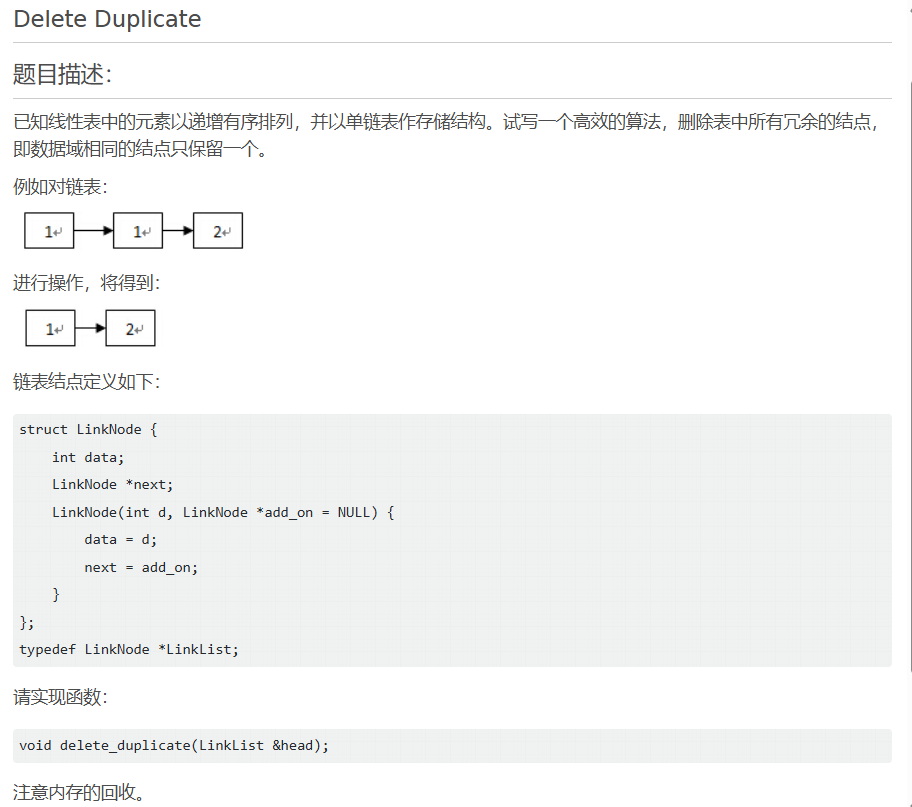
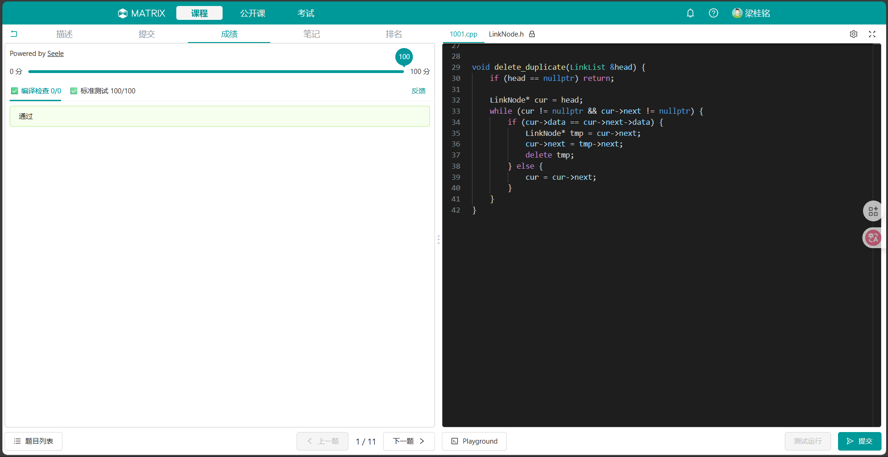
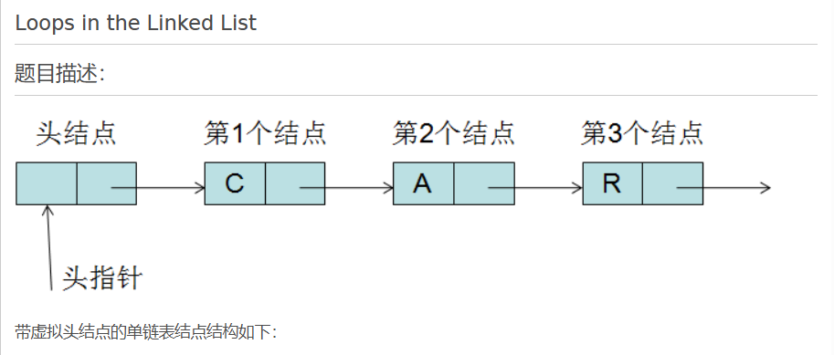
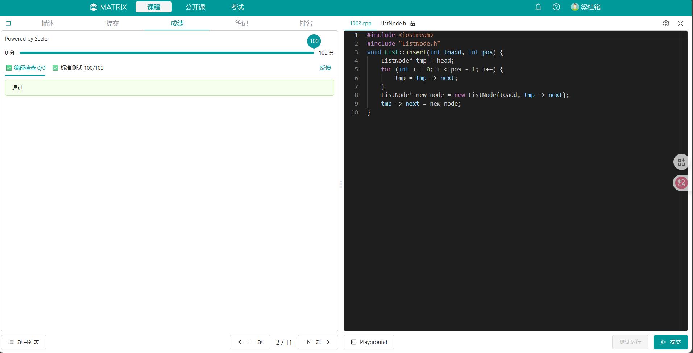
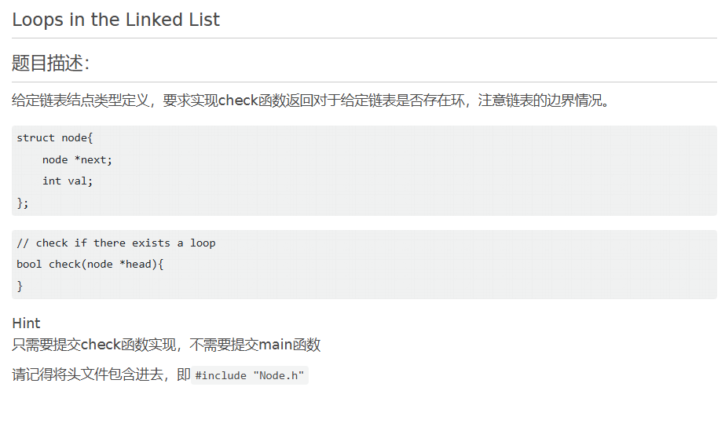
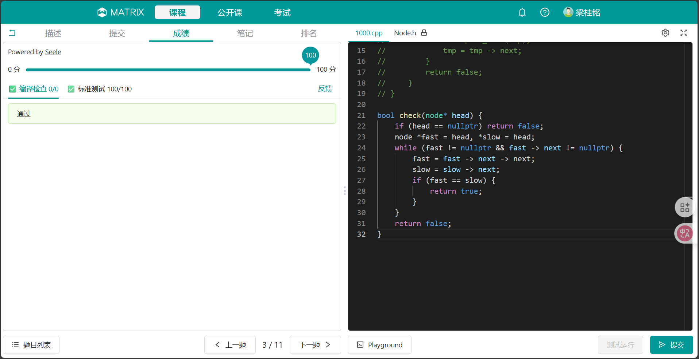
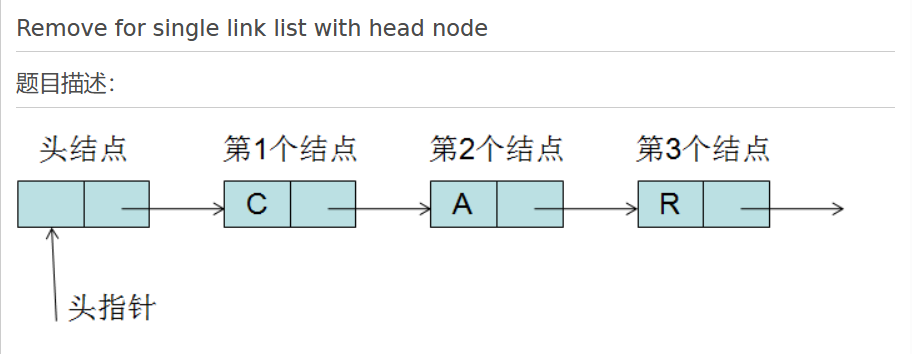
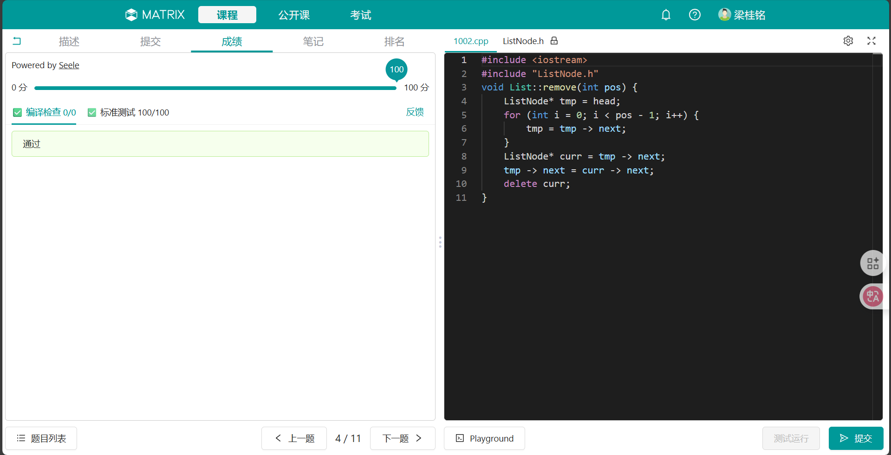

<font face=STKaiti><center>

# 中山大学计算机学院本科生实验报告
### （2025学年第1学期）</center>


课程名称：数据结构与算法实验 &nbsp;&nbsp;&nbsp;&nbsp;&nbsp;&nbsp;&nbsp;&nbsp;任课老师：张子臻
|  |  |  |  |
|:-----:|:-------:|:-------:|:--------:|
| 年级: | 2024级   | 专业(方向):   | 计算机科学与技术(人工智能与大数据)
| 学号: | 24325155 | 姓名: | 梁桂铭
| 电话: | 15817681625 | Email: | lianggm8@mail2.sysu.edu.cn
| 开始日期: | 2025年9月24日 | 完成日期: | 2025年9月24日

---

## 第一题

### 1.实验题目


--- 

### 2.实验目的

1. 掌握**单链表**的定义与基本操作。
2. 学会在**有序链表**中利用顺序特性去除重复结点。
3. 熟悉**指针操作**和链表结点的**内存释放**。

---

### 3.算法设计

1. 创建一个指针`p`指向链表头结点。
2. 遍历链表：
    - 如果`p->data == p->next->data`，说明有重复结点：暂存`p->next`，令`p->next = p->next->next`，再`delete`掉该结点。
    - 否则，将`p`后移。

    遍历直到链表结束。

---

### 4.程序运行与测试

#### matirx测试结果



#### 代码实现

```c++
void delete_duplicate(LinkList &head) {
    if (head == nullptr) return;
    LinkList p = head;
    while (p != nullptr && p -> next != nullptr) {
        if (p -> data == p -> next -> data) {
            LinkList cur = p -> next;
            p -> next = cur -> next;
            delete cur;
        }
        else p = p -> next;
    }
}
```

#### 复杂度分析

- **时间复杂度**：`O(n)`即将整个链表遍历一遍。
- **空间复杂度**：`O(1)`，仅用到常数个辅助指针。

---

### 5.实验总结与心得

本实验主要考察了链表的**遍历**与**修改**操作，尤其是删除结点时**对指针的正确维护**和**内存回收**。得益于链表**有序性**，算法只需一次线性扫描即可完成去重，效率较高。在实现过程中要特别注意**内存释放**，否则会导致内存泄漏。本实验让我更加熟悉了链表操作及其时间、空间复杂度分析。

---

## 第二题

### 1.实验题目
#### 题目描述


请实现如下函数：
`void List::insert(int toadd, int pos)`
其中`toadd`表示要插入的`data`，`pos`表示要插入的位置。

---

### 2.实验目的
1. 掌握单链表的基本操作，特别是带头结点的链表插入操作。
2. 理解插入函数的逻辑过程，包括指针操作和链表结构的维护。
3. 提高对链表数据结构的理解和实际编程能力。

---

### 3.算法设计

1. 定义一个计数变量`i`，从头结点出发，找到第`pos`个位置的**前驱结点**(方便在后面插入元素)。
2. 创建一个新结点`newNode`，将其`next`指针指向前驱结点的`next`。
3. 修改前驱结点的`next`指针，使其指向`newNode`。
4. 完成插入。

---

### 4.程序运行与测试
 
#### matrix测试结果


#### 代码实现
```c++
void List::insert(int toadd, int pos) {
    ListNode* tmp = head;
    for (int i = 0; i < pos - 1; i++) {
        tmp = tmp -> next;
    }
    ListNode* new_node = new ListNode{toadd, tmp -> next};
    tmp -> next = new_node;
}
```
#### 复杂度分析
- **时间复杂度**：`O(n)`需要遍历到`pos`位置，最坏情况遍历整个链表。
- **空间复杂度**：`O(1)`只用到常数个辅助指针。

---

### 5.实验总结与心得

通过本次实验，我掌握了单链表的插入操作的实现过程，进一步理解了带头结点链表的优点：**简化插入和删除的边界情况处理。**同时认识到链表操作中对指针的处理需要特别小心，否则容易出现**断链**或**内存泄漏**问题。

---

## 第三题
### 1.实验题目
#### 题目描述


---

### 2.实验目的
1. 熟悉链表的结构定义及其基本操作。
2. 理解链表中“环”的概念，并掌握检测环的常用方法，包括**哈希表**，**快慢指针**等等。
3. 熟悉**快慢指针**（Floyd 判圈算法）的应用。

---

### 3.算法设计
1. 定义快指针`fast`和慢指针`slow`，使其初始值指向**头节点**。
2. 分别遍历链表，其中`fast`每次往后移动两步，`slow`每次往后移动一步：
    - 若链表中存在**环**，一定会出现使`fast == slow`的时候，返回`true`(当`fast`和`slow`的移动距离差为环的大小时相遇)；
    - 若链表中不存在环，`fast`遍历到`nullptr`，返回`false`

---

### 4.程序运行和测试

#### matrix测试结果



#### 代码实现

```c++
bool check(node* head) {
    if (head == nullptr) return false;
    node *fast = head, *slow = head;
    while (fast != nullptr && fast -> next != nullptr) {
        fast = fast -> next -> next;
        slow = slow -> next;
        if (fast == slow) {
            return true;
        }
    }
    return false;
}
```

#### 复杂度分析

- **时间复杂度**：`O(n)`，因为二者相遇只需要位移差为环的长度的整数倍，所以其只用遍历整个环的常数倍。
- **空间复杂度**：`O(1)`只需要两个辅助指针。

---

### 5.实验总结与心得

通过本实验，我掌握了如何使用快慢指针法检测链表中的环。与**哈希表法**相比，该方法更节省空间，仅需`O(1)`额外内存。同时本题让我更加清晰地认识到链表边界条件的重要性：
- **空链表**或**单节点链表**必须直接返回`false`。
- 指针移动时必须保证`fast`和`fast->next`非空。

---

## 第四题

### 1.实验题目
#### 题目描述


请实现如下函数：
`void List::remove(int pos)`
其中`pos`表示要删除的位置。

---

### 2.实验目的
1. 掌握单链表的基本操作，特别是带头结点的链表删除操作。
2. 理解插入函数的逻辑过程，包括指针操作和链表结构的维护。
3. 提高对链表数据结构的理解和实际编程能力。

---

### 3.算法设计

1. 定义一个计数变量`i`，从头结点出发，找到第`pos`个位置的**前驱结点**(删除之后的元素)。
2. 令前驱节点的`next`指向被删除节点的`next`。
3. `delete`要被删除的节点。

---

### 4.程序运行与测试
 
#### matrix测试结果


#### 代码实现
```c++
void List::remove(int pos) {
    ListNode* tmp = head;
    for (int i = 0; i < pos - 1; i++) {
        tmp = tmp -> next;
    }
    ListNode* curr = tmp -> next;
    tmp -> next = curr -> next;
    delete curr;
}
```
#### 复杂度分析
- **时间复杂度**：`O(n)`需要遍历到`pos`位置，最坏情况遍历整个链表。
- **空间复杂度**：`O(1)`只用到常数个辅助指针。

---

### 5.实验总结与心得

通过本次实验和第二题的`insert`，让我对链表的插入和删除操作更加熟悉，尤其是修改`next`和删除节点的顺序需要分清楚，避免出现野指针。

---

## 附录、提交文件清单

### 第一题
```c++
#include <iostream>
#include "LinkNode.h"
#include <algorithm>
#include <vector>
using namespace std;
// 这是笔者一开始没认真读题，没有注意到是有序链表，因此用了一个hash表去存放每一个不重复的数据。
// void delete_duplicate(LinkList &head) {
//     if (head == nullptr) return;
//     else {
//         vector<int> hash;
//         LinkList dummy = new LinkNode(0, head);
//         LinkList tmp = head, front = dummy;
//         while (tmp != nullptr) {
//             int curr = tmp -> data;
//             if (find(hash.begin(), hash.end(), curr) != hash.end()) {
//                 front -> next = tmp -> next;
//                 delete tmp;
//                 tmp = front -> next;
//             }else {
//                 hash.push_back(curr);
//                 tmp = tmp -> next;
//                 front = front -> next;
//             }
//         }
//         delete dummy;
//     }
// }


void delete_duplicate(LinkList &head) {
    if (head == nullptr) return;

    LinkNode* cur = head;
    while (cur != nullptr && cur->next != nullptr) {
        if (cur->data == cur->next->data) {
            LinkNode* tmp = cur->next;
            cur->next = tmp->next;
            delete tmp;
        } else {
            cur = cur->next;
        }
    }
}
```
### 第二题
```c++
#include <iostream>
#include "ListNode.h"
void List::insert(int toadd, int pos) {
    ListNode* tmp = head;
    for (int i = 0; i < pos - 1; i++) {
        tmp = tmp -> next;
    }
    ListNode* new_node = new ListNode{toadd, tmp -> next};
    tmp -> next = new_node;
}
```
### 第三题
```c++
#include <iostream>
#include <vector>
#include "Node.h"
using namespace std;
// 笔者在一开始用hash表存放每个节点的地址
// bool check(node* head) {
//     if (head == nullptr) return false;
//     else {
//         vector<node*> hash;
//         node* tmp = head;
//         while (tmp != nullptr) {
//             for (auto i : hash) {
//                 if (i == tmp) return true;
//             }
//             hash.push_back(tmp);
//             tmp = tmp -> next;
//         }
//         return false;
//     }
// }

bool check(node* head) {
    if (head == nullptr) return false;
    node *fast = head, *slow = head;
    while (fast != nullptr && fast -> next != nullptr) {
        fast = fast -> next -> next;
        slow = slow -> next;
        if (fast == slow) {
            return true;
        }
    }
    return false;
}
```

### 第四题
```c++
#include <iostream>
#include "ListNode.h"
void List::remove(int pos) {
    ListNode* tmp = head;
    for (int i = 0; i < pos - 1; i++) {
        tmp = tmp -> next;
    }
    ListNode* curr = tmp -> next;
    tmp -> next = curr -> next;
    delete curr;
}
```
</font>