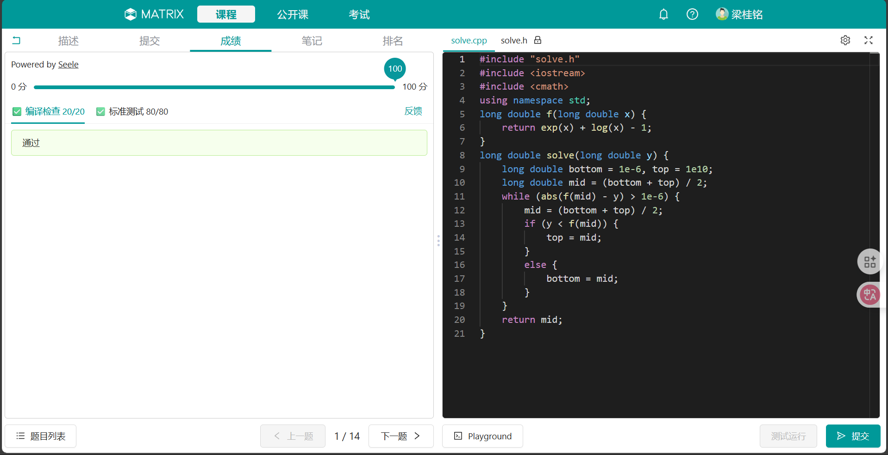
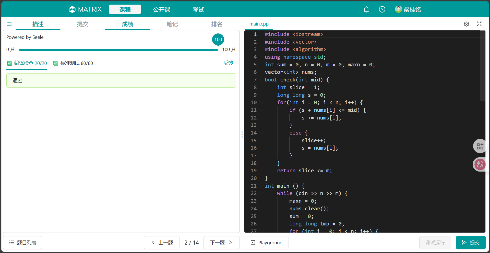
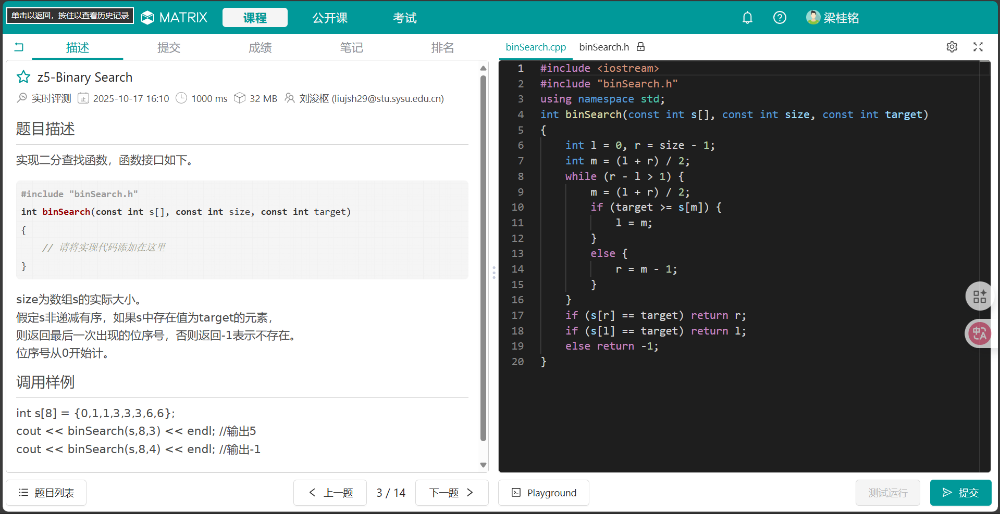

<font face=STKaiti><center>

# 中山大学计算机学院本科生实验报告
### （2025学年第1学期）</center>

课程名称：数据结构与算法实验 &nbsp;&nbsp;&nbsp;&nbsp;&nbsp;&nbsp;&nbsp;&nbsp;任课老师：张子臻
|  |  |  |  |
|:-----:|:-------:|:-------:|:--------:|
| 年级: | 2024级   | 专业(方向):   | 计算机科学与技术(人工智能与大数据)
| 学号: | 24325155 | 姓名: | 梁桂铭
| 电话: | 15817681625 | Email: | lianggm8@mail2.sysu.edu.cn
| 开始日期: | 2025年10月11日 | 完成日期: | 2025年10月11日

---

## 第一题

### 1.实验题目

#### 题目描述

已知函数 `y = e^x + ln(x) - 1`，实现函数 `solve(long double y)`  
对于传入的 `y`，返回满足 `f(x) = y` 的 `x` 值，要求误差小于 `1e-6`，其中 ` 0 < y < 1e10 `。

---

### 2.实验目的

1. 掌握**二分查找法**在连续函数求解中的应用。
2. 理解**单调函数反函数的数值求解**原理。
3. 学会利用**精度控制与误差判断**解决非线性方程问题。

---

### 3.算法设计

#### (1) 思路分析
函数：
`
f(x) = e^x + \ln(x) - 1
`
在 ` x > 0 ` 的范围内严格单调递增，因此对于任意 ` y > 0 `，方程 ` f(x) = y ` 有唯一解。

故我们可以使用 **二分法（Binary Search）** 在区间 `(0, R)` 上搜索使 ` f(x) = y ` 的解。

#### (2) 算法步骤
1. 设定左右边界：`l = 1e-6`, `r = 1e10`。
2. 不断取中点 `mid = (l + r) / 2`；
3. 计算 ` f(mid) = e^mid + ln(mid) - 1 `；
4. 若 `f(mid) < y `，则目标在右侧，`l = mid`；  
   否则，`r = mid`；注意，由于该函数是连续而非离散的，因此不存在类似于`f(mid) < y`时`l = mid - 1`的考虑。
5. 当 `r - l < 1e-6` 时，返回 `mid`。

#### (3) 代码实现

```cpp
#include "solve.h"
#include <iostream>
#include <cmath>
using namespace std;
long double f(long double x) {
    return exp(x) + log(x) - 1;
}
long double solve(long double y) {
    long double bottom = 1e-6, top = 1e10;
    long double mid = (bottom + top) / 2;
    while (abs(f(mid) - y) > 1e-6) {
        mid = (bottom + top) / 2;
        if (y < f(mid)) {
            top = mid;
        }
        else {
            bottom = mid;
        }
    }
    return mid;
}
```

#### (4) 复杂度分析
- **时间复杂度**：`O(log(epx(r) - epx(l))`，每次迭代减半区间；
- **空间复杂度**：`O(1)`，仅使用常数个变量。

---

### 4.程序运行与测试

#### 测试图片



---

### 5.实验总结与心得

本实验通过实现函数反解问题，巩固了**二分查找的数值应用**思想。  
在推导过程中，需要先确认函数**单调性与有界性**，确保二分法适用。  
此外还体会到浮点精度控制的重要性，需根据误差要求调整`eps`取值。  
相比牛顿法，二分法实现更简单且不依赖导数，稳定性更高。  
通过本题，我加深了对**数值计算方法与算法精度控制**的理解。

---

## 第二题

### 1.实验题目

#### 题目描述

把一个包含n个正整数的序列划分成m个连续的子序列（每个正整数恰好属于一个序列）。  
设第i个序列的各数之和为S(i)，如何让所有S(i)的最大值尽量小？  
例如序列`1 2 3 2 5 4`，划分成3个序列的最优方案为`1 2 3 | 2 5 | 4`，其中`S(1)=6, S(2)=7, S(3)=4`，最大值为7；  
如果划分成`1 2 | 3 2 | 5 4`，则最大值为9，不如刚才的好。  
输入：多个样例，每个样例第一行输入n和m，第二行输入n个整数。  
输出：所有划分方案中子序列和的最大值的最小值。

输入样例：
```
6 3
1 2 3 2 5 4
```
输出样例：
```
7
```

---

### 2.实验目的

1. 掌握**二分查找在答案空间中的应用**。
2. 理解**贪心思想**在可行性判断中的使用。
3. 学会解决“**最小化最大值**”类划分问题。

---

### 3.算法设计

#### (1) 思路分析

该题要求在划分后使得每个子序列的和的最大值最小。  
由于序列划分连续且`S(i)`单调变化，可以将问题转化为：

> 在一个给定的最大子段和上限`mid`下，判断能否用不超过`m`个子序列划分所有元素。

我们可用二分搜索答案：

1. 左边界`l`为数组中最大值（每段至少要包含最大元素）；  
2. 右边界`r`为数组总和（只划分成一个序列时）。  
3. 每次取中点`mid`：判断是否可以用不超过`m`段划分完数组；  
   若可以，则说明`mid`可能过大，收缩右边界；否则扩大左边界。  
4. 当`l == r`时即为最优解。

#### (2) 可行性判断函数`check(mid)`
使用贪心策略：从左到右遍历，累积当前段的和`s`，当`s + nums[i] > mid`时开新段。  
若段数超过`m`则说明`mid`太小。

#### (3) 代码实现

```cpp
#include <iostream>
#include <vector>
#include <algorithm>
using namespace std;
int sum = 0, n = 0, m = 0, maxn = 0;
vector<int> nums;
bool check(int mid) {
    int slice = 1;
    long long s = 0;
    for(int i = 0; i < n; i++) {
        if (s + nums[i] <= mid) {
            s += nums[i];
        }
        else {
            slice++;
            s = nums[i];
        }
    }
    return slice <= m;
}
int main () {
    while (cin >> n >> m) {
        maxn = 0;
        nums.clear();
        sum = 0;
        long long tmp = 0;
        for (int i = 0; i < n; i++) {
            cin >> tmp;
            nums.push_back(tmp);
            sum += tmp;
            if(tmp > maxn) {
                maxn = tmp;
            }
        }
        long long r = sum, l = maxn;
        long long mid = (l + r) / 2;
        while (l < r) {
            if (check(mid)) {
                r = mid;
            }
            else {
                l = mid + 1;
            }
            mid = (l + r) / 2;
        }
        cout << r << endl;
    }
    return 0;
}

```

#### (4) 复杂度分析

- **时间复杂度**：`O(n log(sum))`  
  每次二分执行一次O(n)检查。
- **空间复杂度**：`O(n)`  
  存储输入序列。

---

### 4.程序运行与测试

#### 测试样例

| 输入 | 输出 |
|:------:|:------:|
| `6 3
1 2 3 2 5 4` | `7` |


#### 运行截图


#### 结果说明

程序能正确输出最小的最大段和，验证了二分与贪心结合的正确性。

---

### 5.实验总结与心得

本实验让我深入理解了**二分答案法**的思想，即在解空间上使用二分查找，通过判断函数`check`来逐步逼近最优值。  
同时，本题也体现了**贪心策略的局部最优**可以保证全局可行性。  
在实际编程中，注意处理边界条件，如：  
- 当某个元素超过`mid`时必须单独成段；  
- 多组输入需循环读取。  

通过本次实验，我掌握了将复杂优化问题转化为**判定 + 二分**的常见解题模式，为后续算法设计奠定基础。

---

## 第三题

### 1.实验题目

#### 题目描述

实现二分查找函数，函数接口如下：

```cpp
#include "binSearch.h"
int binSearch(const int s[], const int size, const int target)
{
    // 请将实现代码添加在这里
}
```

`size`为数组`s`的实际大小。假定`s`为**非递减有序**，若`s`中存在值为`target`的元素，返回**最后一次出现**的下标；否则返回`-1`。下标从0开始。

调用样例：
```cpp
int s[8] = {0,1,1,3,3,3,6,6};
cout << binSearch(s,8,3) << endl; // 输出 5
cout << binSearch(s,8,4) << endl; // 输出 -1
```

---

### 2.实验目的

1. 理解并掌握**二分查找（Binary Search）**的基本思想与实现。
2. 学会处理**重复元素**时的“最后出现位置”搜索。
3. 熟悉在**有序数组**中利用中点缩小查找范围的技巧。

---

### 3.算法设计

#### (1) 思路分析

普通二分查找在找到目标值后通常直接返回下标，但本题要求返回**最后一次出现的位置**。  
因此需要在找到目标后**继续向右搜索**，直到不再满足条件为止。

#### (2) 算法步骤

1. 初始化左右边界：`l = 0, r = size - 1`；
2. 取中点 `mid = (l + r) / 2`；
3. 若 `s[mid] <= target`，说明目标可能在右半区，为了找到“最后一次”，让 `l = mid + 1`；
4. 否则 `r = mid - 1`；
5. 循环结束后，若 `s[r] == target`，则返回 `r`，若`s[l] == target`，则返回`l`，否则返回 `-1`。

这种方式在每次匹配时继续右移，可以确保最终返回最后出现的下标。

#### (3) 代码实现

```cpp
#include "binSearch.h"

#include <iostream>
#include "binSearch.h"
using namespace std;
int binSearch(const int s[], const int size, const int target)
{
    int l = 0, r = size - 1;
    int m = (l + r) / 2;
    while (r - l > 1) {
        m = (l + r) / 2;
        if (target >= s[m]) {
            l = m;
        }
        else {
            r = m - 1;
        }
    }
    if (s[r] == target) return r;
    if (s[l] == target) return l;
    else return -1;
}
```

#### (4) 复杂度分析

- **时间复杂度**：`O(log n)`  
  每次循环将查找区间减半。
- **空间复杂度**：`O(1)`  
  仅使用常数级变量。

---

### 4.程序运行与测试

#### 运行截图


#### 测试样例

| 输入数组 | target | 输出 | 说明 |
|:-----------:|:-----------:|:-----------:|:-----------:|
| `{0,1,1,3,3,3,6,6}` | `3` | `5` | 最后一次出现位置 |
| `{0,1,1,3,3,3,6,6}` | `4` | `-1` | 不存在 |
| `{1,2,2,2,3}` | `2` | `3` | 连续重复测试 |
| `{5}` | `5` | `0` | 单元素数组 |

#### 运行结果

输出结果如下：

```
5
-1
3
0
```

均符合预期。

---

### 5.实验总结与心得

本实验巩固了**二分查找**的原理与变形应用。  
相比普通查找，本题要求“最后一次出现”，因此在比较时需调整区间移动方向。  
在实现过程中要注意：
- 取中点时避免溢出，使用 `l + (r - l)/2`；
- 结束条件应为 `l <= r`，否则可能遗漏边界元素。  

通过本实验，我进一步掌握了**边界控制与逻辑判断**在算法设计中的重要性，也体会到二分查找不仅能用于查值，还可灵活扩展到“最左”“最右”等变体。

## 附加文件及代码

第一题
```c++
#include "solve.h"
#include <iostream>
#include <cmath>
using namespace std;
long double f(long double x) {
    return exp(x) + log(x) - 1;
}
long double solve(long double y) {
    long double bottom = 1e-6, top = 1e10;
    long double mid = (bottom + top) / 2;
    while (abs(f(mid) - y) > 1e-6) {
        mid = (bottom + top) / 2;
        if (y < f(mid)) {
            top = mid;
        }
        else {
            bottom = mid;
        }
    }
    return mid;
}
```
第二题
```c++
#include <iostream>
#include <vector>
#include <algorithm>
using namespace std;
int sum = 0, n = 0, m = 0, maxn = 0;
vector<int> nums;
bool check(int mid) {
    int slice = 1;
    long long s = 0;
    for(int i = 0; i < n; i++) {
        if (s + nums[i] <= mid) {
            s += nums[i];
        }
        else {
            slice++;
            s = nums[i];
        }
    }
    return slice <= m;
}
int main () {
    while (cin >> n >> m) {
        maxn = 0;
        nums.clear();
        sum = 0;
        long long tmp = 0;
        for (int i = 0; i < n; i++) {
            cin >> tmp;
            nums.push_back(tmp);
            sum += tmp;
            if(tmp > maxn) {
                maxn = tmp;
            }
        }
        long long r = sum, l = maxn;
        long long mid = (l + r) / 2;
        while (l < r) {
            if (check(mid)) {
                r = mid;
            }
            else {
                l = mid + 1;
            }
            mid = (l + r) / 2;
        }
        cout << r << endl;
    }
    return 0;
}

```
第三题
```c++
#include <iostream>
#include "binSearch.h"
using namespace std;
int binSearch(const int s[], const int size, const int target)
{
    int l = 0, r = size - 1;
    int m = (l + r) / 2;
    while (r - l > 1) {
        m = (l + r) / 2;
        if (target >= s[m]) {
            l = m;
        }
        else {
            r = m - 1;
        }
    }
    if (s[r] == target) return r;
    if (s[l] == target) return l;
    else return -1;
}
```